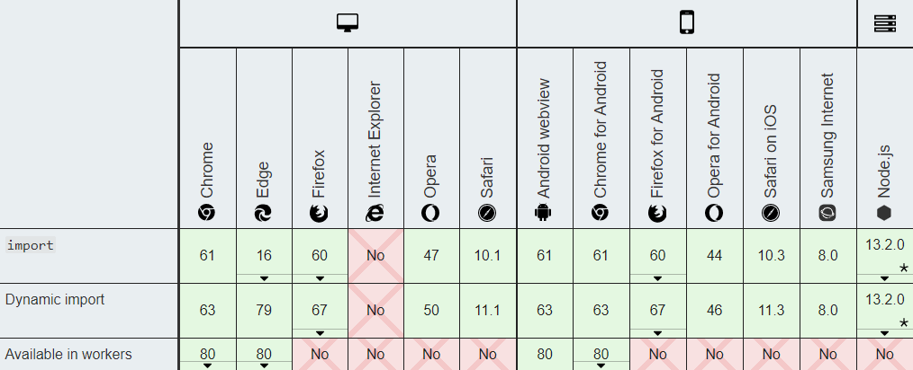

# 前端模块化

[TOC]

为什么我们需要模块化？

## 模块模式

最早，我们写代码比较随意：

```js
function foo() {
    //...
}
function bar() {
    //...
}
```

这种写法容易和全局变量发生命名冲突问题，于是我们有了改进的写法：

```js
var Utils = {
    foo: function(){},
    bar: function(){}
}
Utils.foo()
```

这种写法看似解决了命名冲突问题，其实也暗含了安全问题。我们可以在外部随意访问 Utils.foo 并对其进行修改。

来看 jQuery，jQuery 通过 IIFE，使用`引入全局变量`的方式解决了命名冲突及模块安全问题。

```js
(function (window) {
  const _privateFn = function() {
    console.log('Aha, this is a private Fn')
  }
 }(window))
 _privateFn // undefined
```

[这篇博客](https://www.cnblogs.com/TomXu/archive/2011/12/30/2288372.html)提到了如何解决状态私有问题：

```js
var MODULE = (function (my) {
    const _private = my._private = my._private || {}
    const _seal = my._seal = my._seal || function () {
        delete my._private
        delete my._seal
        delete my._unseal
    }
    const _unseal = my._unseal = my._unseal || function () {
        my._private = _private
        my._seal = _seal
        my._unseal = _unseal
    }

    return my
}(MODULE || {}))
```

## 模块加载

最早，我们这样组织代码：

```js
<script type="text/javascript" src="module1.js"></script>
<script type="text/javascript" src="module2.js"></script>
<script type="text/javascript" src="module3.js"></script>
<script type="text/javascript" src="module4.js"></script>
```

YUI3、KISSY 主要是通过配置的方式来解决文件依赖的问题。

```js
YUI.add('module1', function (Y) {
  // ...
}, '0.0.1', {
    requires: ['node', 'event']
})
```

但是也带来了命名空间冲突的问题。

```js
YUI().use('a', 'b', function (Y) {
  Y.foo()
  // foo 方法究竟是模块 a 还是 b 提供的？
  // 如果模块 a 和 b 都提供 foo 方法，如何避免冲突？
})
```

为什么我们需要模块化？

当下来看，页面内应用正在变得复杂，我们需要使用模块解耦各个 JS 文件，使开发过程变得可维护，在部署过程中优化以提高页面加载性能。

* 如何安全的把模块的API暴漏出去？
* 如何唯一标识一个模块？
* 如何方便的使用所依赖的模块？

## 模块化规范演变

目前有三种主流的模块加载方式，

* CommonJS
* AMD（Asynchronous Module Definition）/ CMD / UMD
* ES6 Module

CommonJS 原名为 ServerJS，推出 Modules/1.0 规范后，在 Node.js 环境下取得了很不错的实践。

```js
// Define in math.js
exports.sum = function(...numbers){
  return numbers.reduce((result, num) => result + num, 0)
}

// Use in other file
var math = require('math')
math.sum(1,3)
```

ServerJS 想进一步推广到浏览器端，于是将社区改名叫 CommonJS。激烈争论 Modules 的下一版规范时，分歧和冲突由此诞生。

James Burke 推荐直接改良 CommonJS 的模块格式以适应浏览器端开发，但是 CommonJS 的发起者并不同意，这也就催生了 RequireJS。James Burke 制定了 AMD 规范，并在 2010 年实现了遵循 AMD 规范的模块加载器 RequireJS。

```js
require(['module/module1.js','module/module2.js'],function(module1,module2){
    module1.printModule1FileName()
    module2.printModule2FileName()
})
```

玉伯（@玉伯）认为 RequireJS 不够完善，并从头开始实现模块加载程序 SeaJS。CMD 是SeaJS 在推广过程中对模块定义的规范化产出。

```js
define(function (require, exports, module) {
    // AMD推崇依赖前置，而CMD推崇依赖就近
    const a = require('./a')
    a.test()
    
    // 软依赖
    if (status) {
        const b = require('./b')
        b.test()
    }
})
```

UMD 则是统一了两种规范的规范，所以 UMD 定义的模块可以同时在客户端和服务端使用：

```js
(function (global, factory) {
  typeof exports === 'object' && typeof module !== 'undefined' ? module.exports = factory() :
  typeof define === 'function' && define.amd ? define(factory) :
    (
        global = global || self, 
        global.myModule = factory()
    )
}(this, (function () {
  return myModule
})))
```

## 现代模块规范 ES6 Module

2015 年 6 月， ECMAScript6 标准正式发布，其中 ES 模块化规范的提出目标是整合 CommonJS、AMD 等已有模块方案，**在语言标准层面实现模块化**，成为浏览器和服务器通用的模块解决方案。

```js
import {foo, bar} from '/modules/my-module.js'

export const foo = Math.sqrt(2)
```

为什么ES模块比CommonJS更好？我引用 RollupJS 文档中的一段加以解释：

ES Module 是官方标准，也是JavaScript语言明确的发展方向，而CommonJS模块是一种特殊的传统格式，在ES模块被提出之前做为暂时的解决方案。 ES模块允许进行静态分析，从而实现像 tree-shaking 的优化，并提供诸如循环引用和动态绑定等高级功能。

在浏览器中，需要使用特定属性的脚本标签，以支持 ES Module 规范（ `<script type="module"> ` ）。

### 兼容性

截止 2020年5月18日，各大浏览器兼容 ES6 Module 情况如下：


在 NodeJS 中（Version >= 8.5），需要打开一个开关（`--experimental-modules`），以支持 ES Module 规范，但是需要模块的文件名为 `.mjs`。

### 动态 Import

动态 Import 如近已经被大部分浏览器所支持：



## 打包工具之争

为什么需要打包工具

* 代码分析（合并、压缩、混淆）
* 兼容各种规范

应用程序使用 WebpackJS，库文件使用 RollupJS

## 阅读更多

* [模块开发的价值](https://github.com/seajs/seajs/issues/547)
* [前端模块的历史沿革](https://www.cyj.me/programming/2018/05/22/about-module-i/)
* [前端模块的现状](https://www.cyj.me/programming/2018/05/23/about-module-ii/)
* [JavaScript 模块化入门Ⅰ：理解模块](https://zhuanlan.zhihu.com/p/22890374)
* [JavaScript 模块化入门Ⅱ：模块打包构建](hhttps://zhuanlan.zhihu.com/p/22945985)
* [前端工程师必备：前端的模块化](https://juejin.im/post/5cb004da5188251b130c773e)